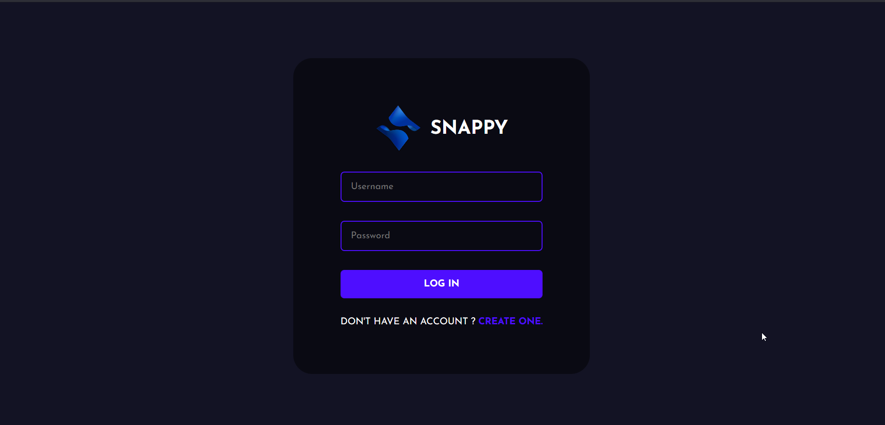

# Snappy - Chat Application

Snappy is a real-time chat application built with the MERN stack, Socket.IO, and React. It supports user registration, login, avatar selection, and live messaging.




## Tech Stack

- Frontend: React
- Backend: Node.js, Express
- Database: MongoDB
- Real-time transport: Socket.IO

## Prerequisites

Before running the project, install the following:

- [Node.js](https://nodejs.org/en/download)
- [MongoDB Community Server](https://www.mongodb.com/docs/manual/administration/install-community/)
  Make sure MongoDB is installed and running locally before starting the backend.

## Project Setup on Windows

The steps below are the recommended Windows setup using PowerShell and `npm`.

### 1. Navigate to the project directory

```powershell
cd chat-app-react-nodejs
```

### 2. Create the environment files

The project uses two `.env` files. Copy the example files and keep the values below.

Frontend environment file: [public/.env](./public/.env)

```env
REACT_APP_LOCALHOST_KEY="chat-app-current-user"
```

Backend environment file: [server/.env](./server/.env)

```env
PORT=5000
MONGO_URL="mongodb://localhost:27017/chat"
```

If you are on Windows PowerShell, you can create them with:

```powershell
Copy-Item .\public\.env.example .\public\.env
Copy-Item .\server\.env.example .\server\.env
```

### 3. Start MongoDB

MongoDB must be running before the backend starts.

Common Windows options:

- Start the MongoDB service from the Services app.
- Or run MongoDB manually with `mongod` if you installed it that way.

You can verify the app is using the local MongoDB instance from the backend env file:

```env
mongodb://localhost:27017/chat
```

### 4. Install dependencies

Open two terminals and install dependencies in both folders.

Backend:

```powershell
cd .\server
npm install
```

Frontend:

```powershell
cd .\public
npm install
```

### 5. Run the backend

In the `server` folder:

```powershell
npm start
```

The backend should start on port `5000`.

### 6. Run the frontend

In a second terminal, inside the `public` folder:

```powershell
npm start
```

The React app should start on port `3000`.

### 7. Open the app

Open your browser and go to:

```text
http://localhost:3000
```

## Docker Setup

If you prefer Docker, make sure Docker Desktop and Docker Compose are installed, then run the following commands from the project root:

```powershell
docker compose build --no-cache
docker compose up
```

After both containers start, open:

```text
http://localhost:3000
```

## Troubleshooting

- If the backend does not start, confirm MongoDB is running and the connection string in `server/.env` is correct.
- If port `3000` or `5000` is already in use, stop the conflicting process or change the port in the relevant `.env` file.
- If you see dependency warnings after `npm install`, the app can still run. Reinstalling with a newer Node.js LTS version may reduce them.
